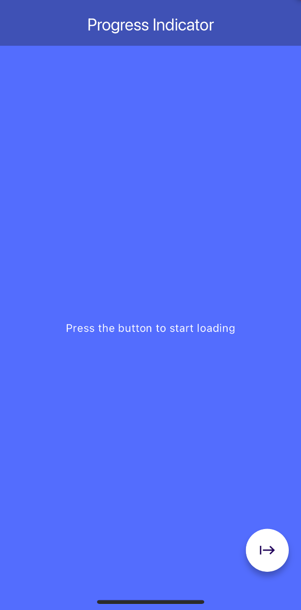

# Flutter Progress Indicator App

This is a simple Flutter application that demonstrates the use of a linear progress indicator with the ability to control it via a button.

## Features

- **Main Screen**: The app features a clean and simple UI with a title and a `FloatingActionButton` that triggers the loading process.
- **Progress Indicator**: A linear progress indicator appears when the button is pressed, showing the loading progress in percentage.
- **GlobalKey Usage**: The app uses `GlobalKey` to manage and access the state of the `WidgetIndicator` from the `FloatingActionButton`.

## Screenshots

  |  

## Installation

1. Clone the repository:
   ```bash
   git clone https://github.com/your-username/flutter-progress-indicator-app.git
